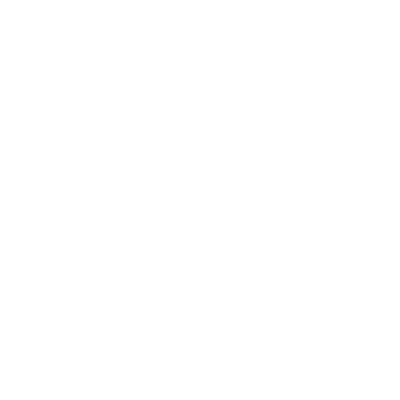
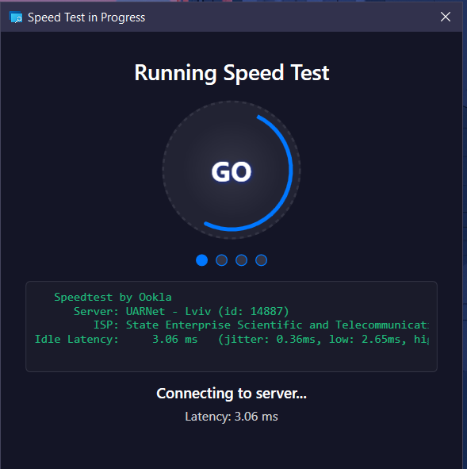
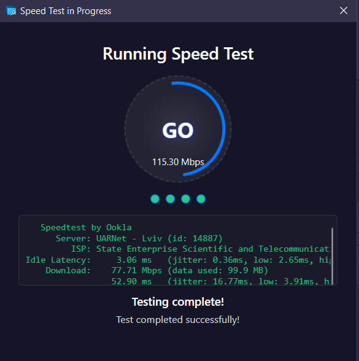
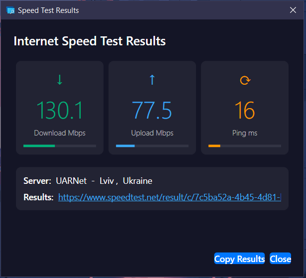

# PowerToys Run: SpeedTest Plugin

<div align="center">
  
  <h3>⚡ Run internet speed tests directly from PowerToys Run ⚡</h3>
  
  <!-- Badges -->
  <a href="https://github.com/ruslanlap/PowerToysRun-SpeedTest/actions/workflows/build-and-release.yml">
    
  </a>
  <a href="https://github.com/ruslanlap/PowerToysRun-SpeedTest/releases/latest">
    
  </a>
  
  
  
  
  <a href="https://github.com/ruslanlap/PowerToysRun-SpeedTest/stargazers">
    
  </a>
  <a href="https://github.com/ruslanlap/PowerToysRun-SpeedTest/issues">
    
  </a>
  <a href="https://github.com/ruslanlap/PowerToysRun-SpeedTest/releases/latest">
    
  </a>
  
  
  <a href="https://github.com/ruslanlap/PowerToysRun-SpeedTest/releases/latest">
    
  </a>
  
  
  <a href="https://opensource.org/licenses/MIT">
    
  </a>
  <a href="https://github.com/hlaueriksson/awesome-powertoys-run-plugins">
    
  </a>
</div>

<div align="center">
  <a href="https://github.com/ruslanlap/PowerToysRun-SpeedTest/releases/download/v1.0.7/SpeedTest-1.0.7-x64.zip">
    
  </a>
  <a href="https://github.com/ruslanlap/PowerToysRun-SpeedTest/releases/download/v1.0.7/SpeedTest-1.0.7-ARM64.zip">
    
  </a>
</div>

## 📊 Download Statistics

<div align="center">
  
  
</div>

## 📝 Overview

**SpeedTest** is a PowerToys Run plugin that lets you check your internet speed instantly from your keyboard. Just type `spt` in PowerToys Run and launch a test—no browser required!

- **Plugin ID:** `5A0F7ED1D3F24B0A900732839D0E43DB`
- **Action Keyword:** `spt` or change to `speedtest`
- **Platform:** Windows 10/11 (x64, ARM64)
- **Tech:** C#/.NET, WPF, PowerToys Run API

## ✨ Features
- ⚡ One-command internet speed test from PowerToys Run
- 📊 Shows download, upload, ping, server info, and shareable result URL
- 🖼️ Beautiful modern WPF UI with animated loading and real-time progress
- 🎨 Classic "running dots" loading animation like Speedtest.net
- 🎨 Theme-aware (dark/light icons, adapts to system theme)
- 📋 Optional clipboard integration (configurable in settings)
- 🎯 Enhanced UI with modern button styling
- 🛡️ Improved stability and error handling
- 🔧 Persistent user settings
- 📝 Copy/share results instantly (optional)
- 🛠️ Robust error handling and informative messages

## 🎬 Demo
<div align="center">
  
  
</div>

## ⚡ Installation

### Prerequisites
- Windows 10/11
- PowerToys installed and running

### Steps
1. Download the appropriate ZIP file for your platform:
   - [x64 version](https://github.com/ruslanlap/PowerToysRun-SpeedTest/releases/download/v1.0.7/SpeedTest-1.0.7-x64.zip)
   - [ARM64 version](https://github.com/ruslanlap/PowerToysRun-SpeedTest/releases/download/v1.0.7/SpeedTest-1.0.7-ARM64.zip)

2. Extract the ZIP file to your PowerToys plugins directory:
   ```
   %LOCALAPPDATA%\Microsoft\PowerToys\PowerToys Run\Plugins\
   ```
   
3. Restart PowerToys completely:
   - Right-click PowerToys in system tray → Exit
   - Start PowerToys again

4. Test the plugin:
   - Press `Alt+Space` to open PowerToys Run
   - Type `spt` and hit Enter
   - Configure clipboard settings in PowerToys settings if needed

## 🚀 Usage     
- Open PowerToys Run (`Alt+Space`)
- Type `spt` and select `Run Speed Test`
- Enjoy the beautiful loading animation and view real-time progress
- Results window will flash when complete to get your attention
- Press `Esc` at any time to cancel the test or close the results window
- Configure clipboard settings in PowerToys settings
- Click the result URL to view/share your result online

## 📢 What's New in v1.0.7

- **⌨️ Improved Controls** - Press `Esc` to cancel a running test or close results window
- **🛡️ Better Error Handling** - Improved handling of network connectivity issues
- **⚡ Optimized Performance** - Reduced resource usage during tests
- **🖱️ Enhanced UI Responsiveness** - More responsive interface during long-running tests
- **📝 Clear User Feedback** - Better feedback when test is canceled by user

## 🛠️ Building from Source
- Requires .NET 6+ SDK and Windows 10/11
- Clone the repo and open `Templates.sln` in Visual Studio
- Build the `SpeedTest` project (x64 or ARM64)
- Output: `SpeedTest-x64.zip` or `SpeedTest-ARM64.zip` in the root directory

## 📊 Project Structure
```
SpeedTest/
├── Community.PowerToys.Run.Plugin.SpeedTest/    # Plugin source code
├── data/                                       # Demo assets and icons
├── tests/                                      # Unit & integration tests
├── Publish/                                    # Build output
├── CHANGELOG.md                                # Version history
├── CONTRIBUTE.md                               # Contributing guidelines
├── RELEASE.md                                  # Release notes
```

## ❓ FAQ
<details>
<summary><b>How do I change the plugin's theme?</b></summary>
<p>Theme adapts automatically to your system. Dark and light icons are included.</p>
</details>
<details>
<summary><b>Where are my results stored?</b></summary>
<p>Results are not stored persistently; you can copy or share them after each test.</p>
</details>
<details>
<summary><b>How do I enable/disable clipboard copying?</b></summary>
<p>Go to PowerToys settings, find the SpeedTest plugin section, and toggle the clipboard option.</p>
</details>
<details>
<summary><b>Does it work offline?</b></summary>
<p>No, an internet connection is required to run speed tests.</p>
</details>
<details>
<summary><b>Can I choose a specific server?</b></summary>
<p>Not yet, but server selection support is planned for future releases.</p>
</details>

## 🛠️ Troubleshooting

- **Plugin does not appear in PowerToys Run**  
  Make sure you extracted the plugin to the correct folder and restarted PowerToys.
- **Icons do not update**  
  Try deleting the old plugin folder before copying the new version.
- **Speed test does not run**  
  Ensure you have an active internet connection and permission to run speedtest.exe.
- **Clipboard copying not working**  
  Check if clipboard copying is enabled in PowerToys settings.

## 🔒 Security & Privacy

- The plugin does not store your test history
- All tests are performed locally using the official speedtest CLI
- No third-party APIs or data collection
- Optional clipboard integration (disabled by default)

## 🧑‍💻 Tech Stack

- C# / .NET 9.0
- WPF (UI)
- PowerToys Run API
- GitHub Actions (CI/CD)
- JSON for settings storage

## 🤝 Contributing
Contributions are welcome! Please read our [Contributing Guide](CONTRIBUTING.md) before submitting a pull request.

### Contributors
- [ruslanlap](https://github.com/ruslanlap) - Project creator and maintainer

## 📸 Screenshots
<div align="center">
  
  
  
</div>

## ☕ Support
Enjoying SpeedTest? ☕ Buy me a coffee to support development:

[](https://ruslanlap.github.io/ruslanlap_buymeacoffe/)

## 📄 License
MIT License. See [LICENSE](LICENSE).

## 🙏 Acknowledgements
- [Microsoft PowerToys](https://github.com/microsoft/PowerToys) team
- [Ookla Speedtest CLI](https://www.speedtest.net/apps/cli)
- All contributors and users!

---

<div align="center">
  <sub>Made with ❤️ by <a href="https://github.com/ruslanlap">ruslanlap</a></sub>
</div>